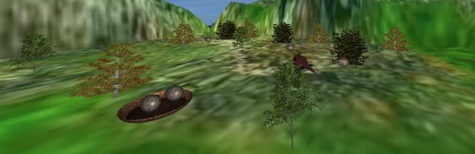

# CG 2022/2023

## Group T08G10

## Project

### 1. Criação da esfera

- A criar a esfera, não demonstramos imensas dificuldades.
- A parte mais complicada foi aplicar a textura, nomeadamente a parte onde tivemos de deduzir o angulo azimutal.

### 2. Criação de Panoramas

- Tivemos um problema que demoramos algum tempo a resolver, que se deveu ao facto de não termos conseguido mapear a textura perfeitamente.
- Experimentamos vários fovs escolhemo usar 1.9 
- Também centramos o panorama com a posição da câmara.
- Tiramos duas screenshots, para diferentes perspectivas.

### 3. Inclusão de uma Ave

- Para a criação da ave usamos os sólidos encontrados nas figuras abaixo.
- Criamos também uma classe para asa, pois simplificou a criação da ave.
- Das partes mais difíceis foi mesmo acertar com as transformações para que a asa ficasse na posição correta.
- Quanto às animações, a parte que nos causou mais problemas foi animar as asas pois não estávamos a acertar com os angulos de rotação.

### 4. Terreno

- Esta etapa do projeto era bastante parecida com a TP5, como tal não tivemos grandes dificuldades. Há uma grande diferença de altura na margem da zona plana, e nota-se uma mancha laranja nesta margem devido à altimetria. No entanto, consideramos que estes defeitos são consequências de ter uma zona plana.

- Tiramos 3 screenshots que permitem ver diferentes perspectivas do terreno com a ave em cima do lago. É possivel ver a influencia da cor da altimetria que usamos com um peso de 30%.

### 5. Ovos e Ninho

- Para os ovos, utilizamos duas semi-esferas. A cada uma destas aplicamos um scale diferente, de modo a que um que fique mais "alongada" num dos hemisférios. Em vez de utilizarmos vários objetos da classe ovo, utilizamos sempre o mesmo e simplesmente aplicamos-lhe vários translates de modo a colocá-lo onde pretendíamos para cada um dos ovos que aparece na cena.
- Para o ninho, decidimos usar também uma semi-esfera com um scale no plano x0z. Visto que este ninho não tem uma base plana, utilizamos um círculo que colocamos dentro da semi-esfera para obter esta base plana, para depois facilitar a colocação dos ovos no ninho.
- Para as colisões entre o pássaro e os ovos, consideramos a ponta do bico e a equação da projeção do ovo no plano xz (ou seja, de duas semi-elipses). Para a colisão entre o ovo e o ninho. Consideramos essa mesma projeção e a projeção do ninho no plano xz (um círculo). Este cálculo revelou-se mais complicado, pelo que não o resolvemos analticamente. Inicialmente, verificamos se a distância de 8 pontos da elipse ao centro do círculo eram superiores ao raio do círculo. Caso nenhuma destas distâncias fosse superior, consideramos que houve colisão (ou seja, quando o ovo está completamente dentro do ninho). Quando fizemos a animação da queda em parábola, passamos a verificar que para pelo menos um desses pontos a distância é superior ao raio do círculo mas que para todos os pontos esta distância era menor que o dobro do raio do círculo (ou seja, o ovo não está completamente dentro do ninho mas está completamente dentro do círculo com o dobro do raio do ninho).

### 6. Integração de Árvores
- Decidimos usar 3 texturas, e logo a seguir cada textura é atribuida a cada árvore ao acaso.
- Temos no nosso terreno um group patch e um row patch, logo são 15 árvores no total.
- Para além da textura fornecida no moodle decidimos escolher mais duas:
- Big tree: https://www.techmonkeybusiness.com/galleries/Texture_Galleries/Billboard_Trees/images/001-Bigtree1.png
- Small elegant tree: https://sansarweb-media-production-w.akamaized.net/b20b4c09-b41b-4f87-aebe-267f41085845_800.png

### 7. Desenvolvimentos adicionais
- Escolhemos desenvolver a trajetória em parábola do ovo quando é largado pela ave para ser depositado no ninho.
- Para isto, fixamos o tempo de queda de um segundo. Utilizando as equações do movimento  (x = x0 + v0xt, z = z0 + v0zt e y = y0 + 1/2ayt^2) descobrimos qual a v0x,ay e v0z que resulta no tempo de queda de um segundo. 
- Utilizando estas acelerações e velocidades, calculamos a posição para cada instante entre t=0 e t=1.

