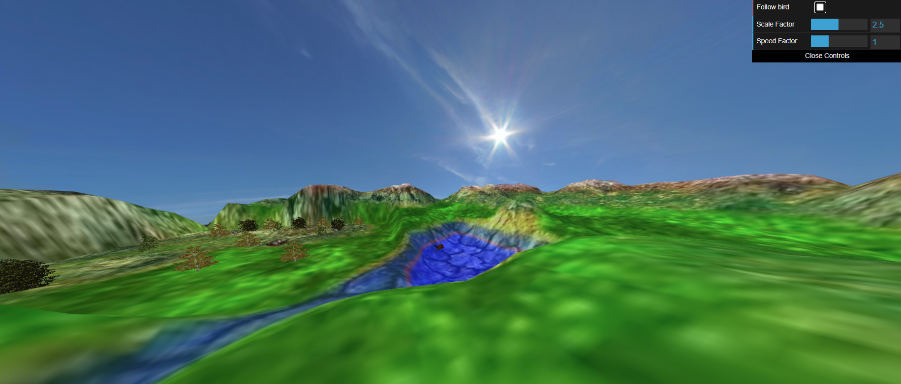

# CG 2022/2023

## Group T08G10

## Project

### 1. Criação da esfera

- A criar a esfera, não demonstramos imensas dificuldades.
- A parte mais complicada foi aplicar a textura, nomeadamente a parte onde tivemos de deduzir o angulo azimutal.

### 2. Criação de Panoramas

- Tivemos um problema que demoramos algum tempo a resolver, que se deveu ao facto de não termos conseguido mapear a textura perfeitamente.
- Experimentamos vários fovs escolhemo usar 1.9 
- Também centramos o panorama com a posição da câmara.
- Tiramos duas screenshots, para diferentes perspectivas.

### 3. Inclusão de uma Ave

- Para a criação da ave usamos os sólidos encontrados nas figuras abaixo.
- Criamos também uma classe para asa, pois simplificou a criação da ave.
- Das partes mais difíceis foi mesmo acertar com as transformações para que a asa ficasse na posição correta.
- Quanto às animações, a parte que nos causou mais problemas foi animar as asas pois não estávamos a acertar com os angulos de rotação.

### 4. Terreno

- Esta etapa do projeto era bastante parecida com a TP5, como tal não tivemos grandes dificuldades. Há uma grande diferença de altura na margem da zona plana, e nota-se uma mancha laranja nesta margem devido à altimetria. No entanto, consideramos que estes defeitos são consequências de ter uma zona plana.

- Tiramos 3 screenshots que permitem ver diferentes perspectivas do terreno com a ave em cima do lago. É possivel ver a influencia da cor da altimetria que usamos com um peso de 30%.

