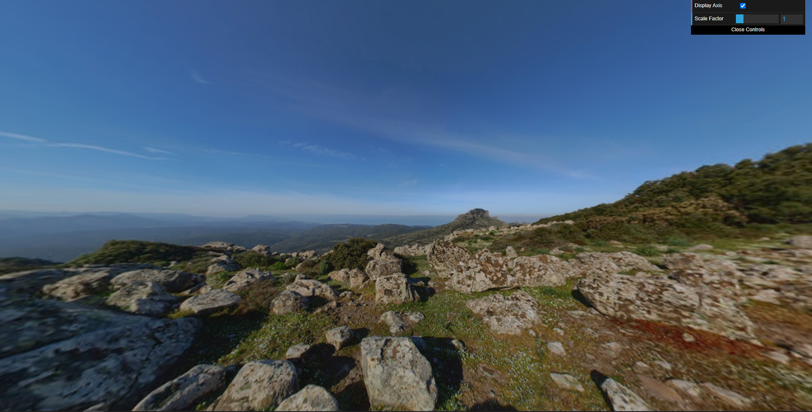

# CG 2022/2023

## Group T08G10

## Project

### Criação da esfera

- A criar a esfera, não demonstramos imensas dificuldades.
- A parte mais complicada foi aplicar a textura, nomeadamente a parte onde tivemos de deduzir o angulo azimutal.

### Criação de Panoramas

- Tivemos um problema que demoramos algum tempo a resolver, que se deveu ao facto de não termos conseguido mapear a textura perfeitamente.
- Experimentamos vários fovs escolhemo usar 1.9 
- Também centramos o panorama com a posição da câmara.
- Tiramos duas screenshots, para diferentes perspectivas.

