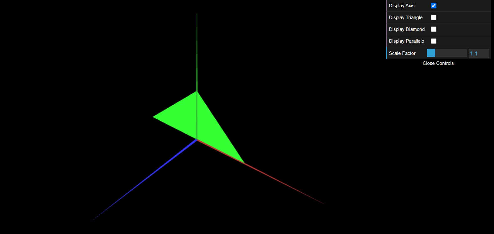

# CG 2022/2023

## Group T08G10

## TP 1 Notes

- In exercise 1 we observed the basics of the CFG libraries that we have available to us. It was fun to see how the library works and how we can include objects in our scence. We also had some difficulties in the first exercise, but we managed to solve them.
- In exercise 2 we had difficulties in the beginning, but we managed to solve them. We also had some difficulties in the second exercise, but we managed to solve them.
- Below we have a screenshot of the second exercise. The small triangle is not visible because it is behind the big triangle.

/home/rui-exe/cg-t08-g10/tp1/screenshots