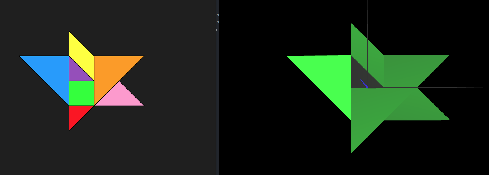
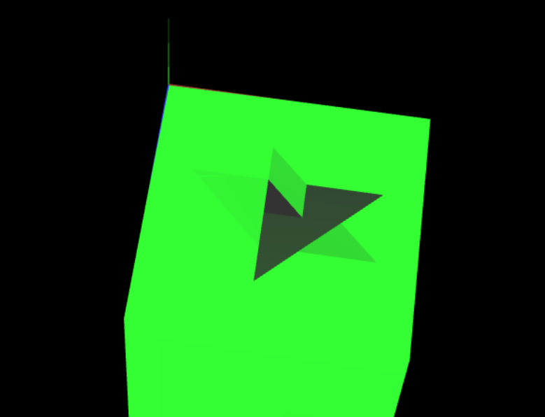

# CG 2022/2023

## Group T08G10

## TP 2 Notes

**Tangram**

- In exercise 1 we had a bit of difficulties while creating the matrix for the diamond without the help of the cfg library.
- In exercise 2 we just placed all the pieces in scene, it wasn't that hard.
- In exercise 3 we had to think a lot and also do some mathemathics to get the correct values for all the translations and rotations matrices.

**MyUnitCube**
- In this exercise, the hardest part was thinking about the order of the points in the indices array
- After having the cube, the translation required to put the cube in the correct position was pretty straight forward

**MyUnitCubeQuad**
- In this exercise, we had to create a cube with Quads instead of triangles.
- We found this exercise to be really funny because we could use only rotations on the various axis to only one quad and form the cube that way.

