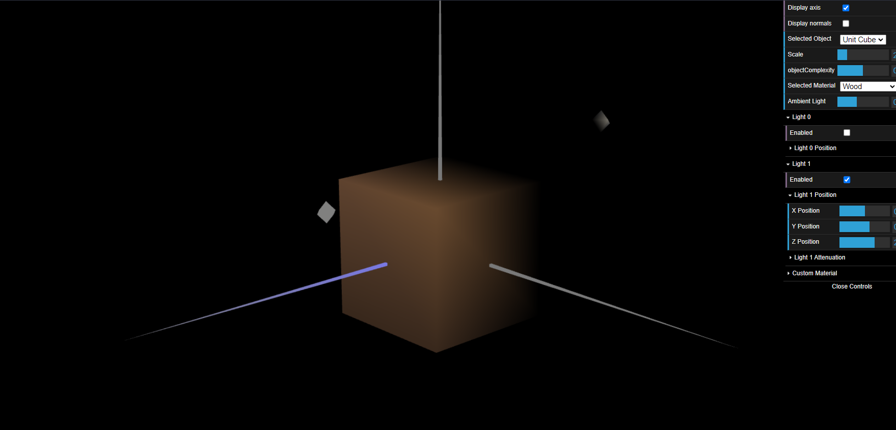
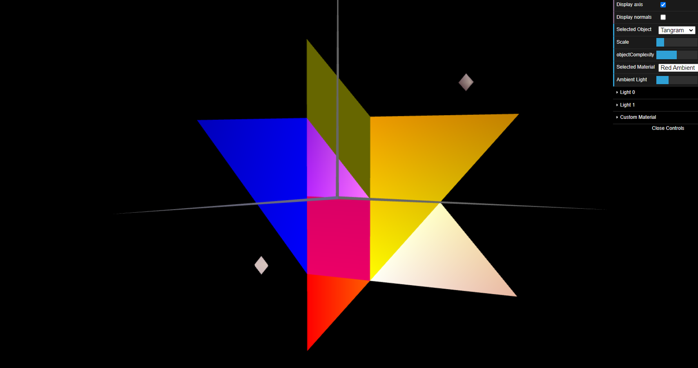
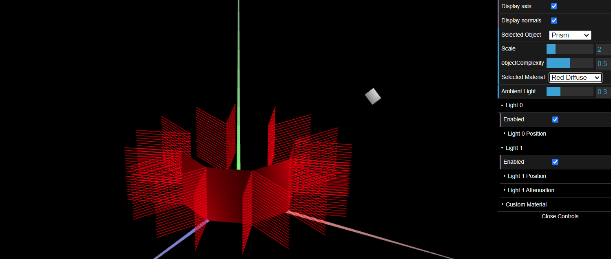

# CG 2022/2023

## Group T08G10

## TP 3 Notes

**Part1**

- We had a lot of fun exploring the differents types of lights and how they affect the scene.
- We also didn't have any major difficulties when creating the normals for the different objects.

- We had a bit of difficulties when creating all the different materials, for the tangram, but we managed to do it in the end.

**Part2**

- We had a bit of difficulties finding out what the correct indices were, when drawing the prism, but we managed to do it in the end.
- When creating the normals for the prism, we had a bit of difficulties, because we had to duplicate each vertex, and then create the normals for each of the duplicated vertices.
- It is simillar to Constant Shading, because we use the normal of one point of each side (in this case, the center of the side) as the normal for each of the 4 vertices of that side. We are basically assuming that each vertex (hence every single point of the side since the light of every single point in the side is calculated as an interpolation from the light of the vertices) has the normal of the center of the side.
- We assumed that "vertical column" meant a column whose base is in the z=0 plane, and that the column was supposed to always have height 1, in spite of the number of stacks.

