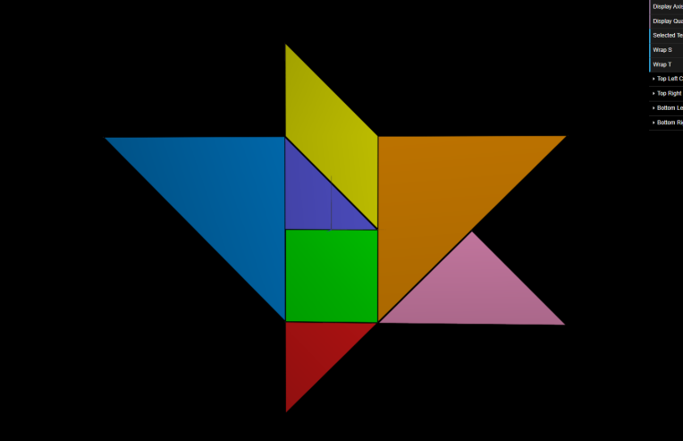
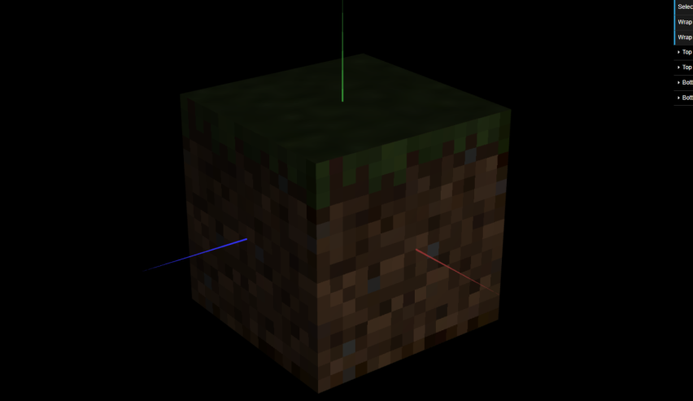

# CG 2022/2023

## Group T08G10

## TP 4 Notes

### Applying textures to the tangram

- This part we had trouble with the parallelogram, because our indices were a bit weird so we had to fix them, in order for the texture to be applied correctly.

### Applying textures to the cube composed of 6 planes

- No major issues here, we just had to apply the texture to each plane, and uncomment the line of code in the scene class, to apply nearest filtering.

