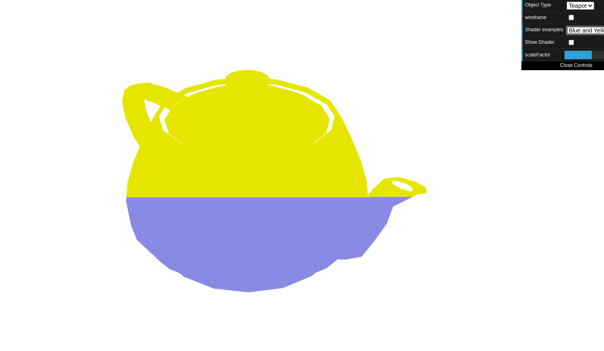
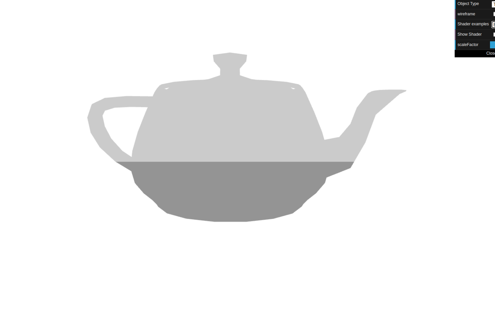
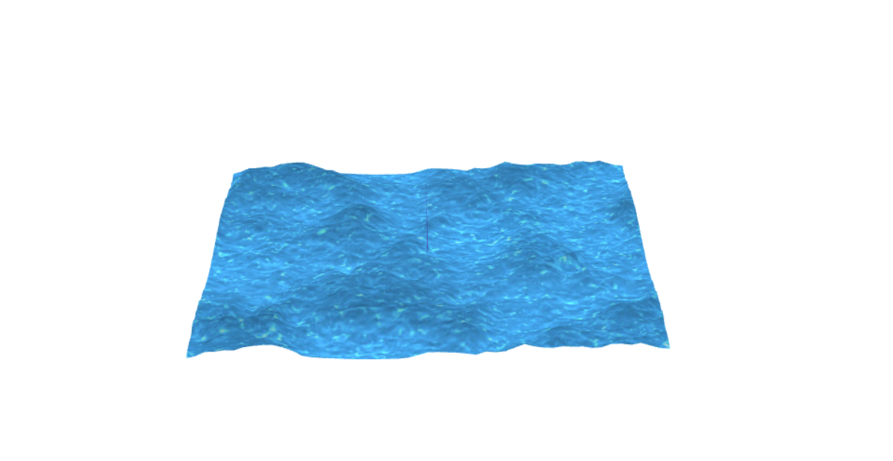

# CG 2022/2023

## Group T08G10

## TP 5 Notes

### Shaders no Teapot

- We didn't have major problems with applying the shader to the teapot, although we were a bit confused with the change of color depending on the y position of the teapot.

- The sepia shader was applied to the teapot, and the result was satisfactory.

### Shaders no Plane: Efeito de água

- We had some problems with this part, because we didn't know where to start, with the animition process
- But we figured it out along the way

